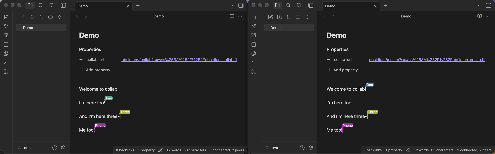

# Collab

Real-time, end-to-end encrypted, peer-to-peer, collaborative editing across Obsidian vaults for files and folders.

Built on [open protocols](#how-it-works).
Servers only help peers find each other and never see your files.

Help keep Obsidian Collab running by [self-hosting](#self-hosting) a community signalling server for free!




## Getting started

1. Install the plugin, and tell other peers to as well
2. Set your name in the plugin ettings if you don't want to show up as Anonymous
3. Run `Collab: Share file` on the file you want to share
4. Send peers the URL privately, anyone with the URL can sync the file
5. Opening the URL prompts Obsidian to create the shared file
6. Files will sync between peers that are online
7. When you're done working together run `Collab: Disconnect file`
8. Changes you do while disconnected will sync when you connect again
9. When you want to work together again run `Collab: Connect file`
10. If you won't want to share the file anymore run `Collab: Stop sharing file`

Use `folder` instead of `file` commands if you need to work with multiple files.

Use the `File Recovery` core plugin to save past versions of files and revert to them if you need to.


## Troubleshooting

### What exactly can the servers see?

Signalling, STUN and TURN servers see your IP address.
Signalling servers also see a hashed room id and encrypted connection offers.
When a direct connection isn't possible, a TURN server relays your traffic, which stays encrypted.
Collab has no telemetry.

### I can't connect to other peers

Run `Collab: Check network` to see if you should be able to connect right now.

Then `Collab: Diagnostics` and copy paste the result into [a new issue](https://github.com/filipesilva/obsidian-collab/issues/new) so I can try to help.

### Collab says I need a TURN server

This means that other peers can't directly connect to your device and need to relay connections through a public server.
[TURN](#turn) is meant to solve that problem.
The easiest way to get a TURN server is https://www.expressturn.com.
Make a new account there, put those credentials in the Collab settings, and click the test button to check it works.
Only peers that get this notification need to do this.
You can [self-host](#self-hosting) one too if you want.

### I need to make a new file URL because mine leaked or the servers don't work anymore

Use `Collab: Regenerate file URL`, then give that link to your peers.
It will have a new secret and a new set of servers, and when opened update the existing shared file.

### Why do I need to use the same folder name when working on a shared folder?

So Obsidian links work correctly for everyone.

### Text got a bit weird or missing when syncing over changes

There's no real way to cover all the text syncing cases, but this should be rare.
You'll need to fix it manually.
The `File Recovery` core plugin helps here by showing you past versions.

### I don't want to use anything public

See the [self-hosting](#self-hosting) section.
You can host everything yourself, and replace all the defaults in the settings.


### Images, Bases, Canvases, and other files aren't syncing in a shared folder

Collab only syncs markdown files right now.


## How it works

Collab uses the [WebRTC protocols](https://developer.mozilla.org/en-US/docs/Web/API/WebRTC_API/Protocols) to connect peer-to-peer.
These protocols are usually used for video conferencing in Zoom/Google Meet/Discord, but they can also transmit arbitrary data.

Collab uses [Yjs](https://github.com/yjs/yjs) to sync text over the WebRTC protocols.
It syncs using a [CRDT](https://en.wikipedia.org/wiki/Conflict-free_replicated_data_type), which means it works a bit like Google Docs and is smart about handling changes from multiple peers.

There's 3 types of servers involved in these protocols that you can configure in the plugin settings:
- STUN: these let you know what your public address is so you can tell other peers
- Signalling: these let peers coordinate connections between themselves
- TURN: these relay your connections over a public server, and are only used when there's no way to directly connect

Cloudflare and Google have public STUN servers so we use those directly.
They are cheap to run so we're not really worried about them going down.

Signalling servers are usually custom for each app, but [Trystero](https://github.com/dmotz/trystero) lets us use public [Nostr](https://nostr.com/info) servers for signalling.
I also run a community one on the Cloudflare Workers free plan, and hope [more people do too](#self-hosting).
Collab uses community ones before trying public ones so we don't put too much load on the public ones.

TURN servers are not as easy as the others because they serve as relay and so all the (encrypted) data for that peer goes through them.
But only peers that can't connect directly need them, which should be rare.
[ExpressTURN](https://www.expressturn.com/) and others offer a free tier if you need it.


## Self-hosting

This repository has a Trystero-compatible minimal Nostr relay you can host on [Cloudflare Workers](https://www.cloudflare.com/products/workers/) for free, as long as you make an account:
- `git clone https://github.com/filipesilva/obsidian-collab`
- `cd obsidian-collab`
- `cd worker`
- `npm install`
- `npx wrangler login` to make an account and login
- `npm run deploy`
- it will ask you for a subdomain to use, I picked `filipesilva` for mine
- the signalling server will be `wss://obsidian-collab.<subdomain you picked>.workers.dev`

It works pretty well because signalling uses little traffic and is easy to do with Cloudflare Workers.
If like using Collab I encourage you to make a community one too and add it via a PR to `COMMUNITY_RELAYS` in `src/network.ts` so we have more of our own.

If you replace `Community Collab relays` with just your server, and remove all the `Public Nostr relays`, then files you share will only use your server for signalling.

Hosting STUN and TURN servers is a bit harder but you can do it with [coturn](https://github.com/coturn/coturn).
If you don't need TURN I think it's fine to use the public STUN servers even if you're very privacy conscious.


## Development

```
npm install
npm run test-deps  # downloads chromium for the tests
npm run dev     # esbuild watch
npm run build   # typecheck and bundle main.js
npm test        # fast tests in headless Chromium, no servers
npm run test-network  # network tests: local relay and TURN, plus public relays
npm run lint
npm run e2e     # end to end in test-vaults/one, two and three; needs Obsidian running and npm run build
```
